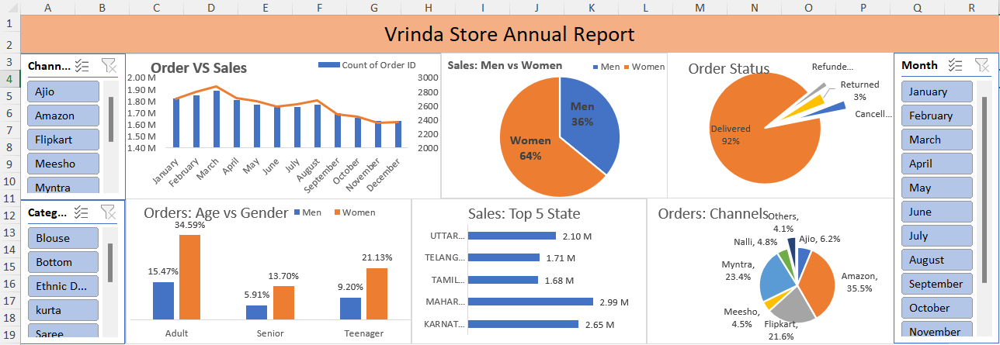

# Dashboard Preview



# Vrinda Store Annual Sales Dashboard (Excel Project)

## Project Overview

The **Vrinda Store Annual Sales Dashboard** is an interactive **Excel-based business intelligence dashboard** designed to analyze and visualize the annual sales performance of Vrinda Store.

The dashboard helps businesses understand sales trends, customer behavior, order status, and channel performance. It enables decision-makers to identify key insights and improve business strategies.

# Project Objectives

The main objectives of this project are:

* Analyze **annual sales performance**
* Understand **customer purchasing patterns**
* Identify **top-performing states**
* Compare **sales between men and women**
* Track **order status distribution**
* Analyze **sales by different channels**
* Provide **interactive filtering using slicers**

# Dataset Information

The dataset used in this project contains information about:

* Order ID
* Date
* Sales amount
* Customer gender
* Customer age group
* Sales channel
* Order status
* Product category
* State
* Month

The data was cleaned and transformed before building the dashboard.

# Key Dashboard Metrics

The dashboard highlights several important KPIs:

| KPI             | Description                                |
| --------------- | ------------------------------------------ |
| Total Orders    | Total number of orders placed              |
| Total Sales     | Total revenue generated                    |
| Sales by Gender | Sales distribution between men and women   |
| Order Status    | Delivered, Returned, Cancelled, Refunded   |
| Sales by State  | Top 5 states contributing to revenue       |
| Sales Channels  | Amazon, Flipkart, Myntra, Meesho, Ajio etc |

# Dashboard Insights

### 1️⃣ Order vs Sales Trend

Shows monthly trends of:

* Total orders
* Sales revenue

Helps identify **peak sales months and seasonal patterns**.

### 2️⃣ Sales: Men vs Women

Key insight:

* **Women contribute ~64% of total sales**
* **Men contribute ~36% of total sales**

This helps understand **target customer demographics**.

### 3️⃣ Order Status Distribution

Majority of orders are:

* **Delivered: ~92%**
* Small percentage are **Returned / Cancelled / Refunded**

This indicates **efficient order fulfillment**.

### 4️⃣ Orders by Age & Gender

Customer segmentation:

* Adult
* Teenager
* Senior

Adults contribute the **highest number of orders**, especially among **female customers**.

### 5️⃣ Top 5 States by Sales

The top contributing states include:

* Maharashtra
* Karnataka
* Uttar Pradesh
* Telangana
* Tamil Nadu

These regions generate the **largest portion of revenue**.

### 6️⃣ Orders by Sales Channel

Sales channels include:

* Amazon
* Flipkart
* Myntra
* Ajio
* Meesho
* Nalli

**Amazon and Myntra contribute the highest share of sales.**

# Excel Features Used

* Pivot Tables
* Pivot Charts
* Slicers
* Timeline Filters
* Conditional Formatting
* Data Cleaning
* Dashboard Design

# Business Insights

Key takeaways from the dashboard:

✔ Women customers contribute the majority of sales

✔ Adult age group dominates purchasing behavior

✔ Amazon is the leading sales channel

✔ Maharashtra and Karnataka generate the highest revenue

✔ Order delivery success rate is very high (~92%)

# Project Structure

```
Vrinda-Store-Annual-Report
│
├── Vrinda_Store_Annual_Report.xlsx
├── README.md
└── Dashboard Screenshot.png
```
